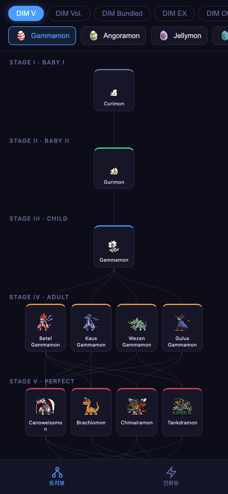
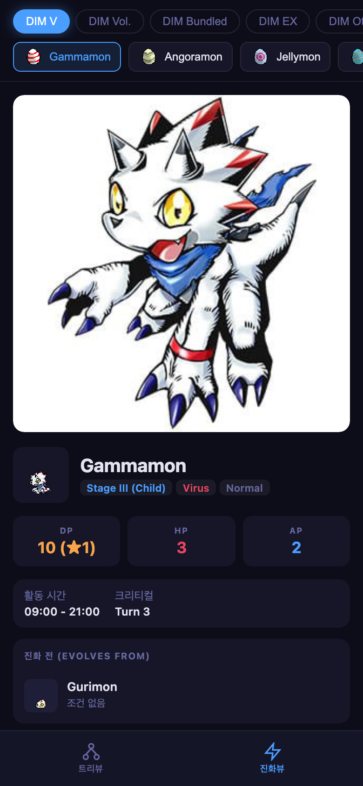
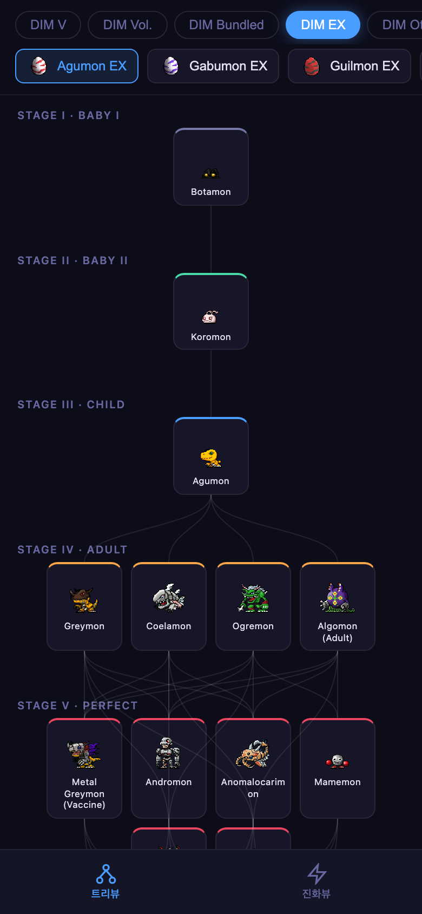
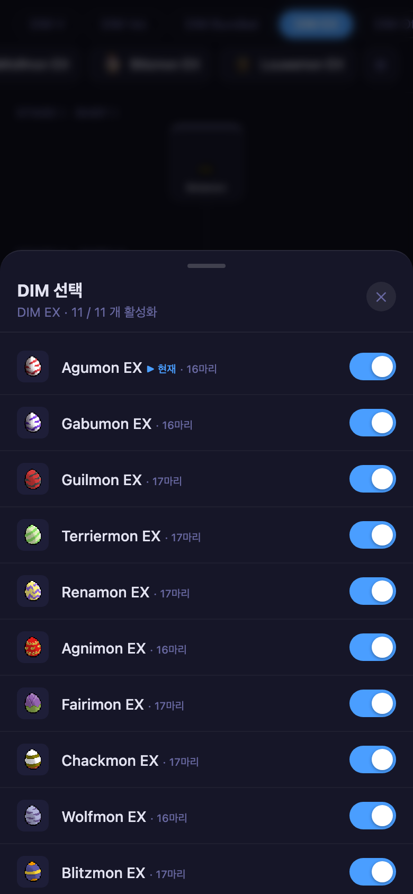

# Digimon Evolution Parsing

A project that extracts and normalizes sprites, illustrations, evolution trees, and Digimon encyclopedia data from the **Vital Bracelet Series** (VBDM / VBBE), with a mobile viewer app to explore them.

```
digimon_evol_parsing/
├── assets/        ← Data package (game-dev ready)  →  assets/README.md
└── app/           ← Mobile web viewer              →  app/README.md
```

The two areas are **managed independently**. `assets/` is a self-contained data + access library package that can be dropped into any game project, while `app/` is one example viewer that consumes it.

### Web Viewer

| Tree View | Evolution Detail |
|-----------|-----------------|
|  |  |
| Stage-based chart with SVG connection lines | Artwork, stats, evolution conditions, Digimon encyclopedia |

| EX Category | DIM Selector Sheet |
|-------------|-------------------|
|  |  |
| Restored evolution edges for EX cards | Toggle individual DIMs on/off |

---

## At a Glance

| | |
|---|---|
| Categories | 8 (DIM V/Vol/Bundled/EX/Other, BE Anime/Special/Seekers) |
| DIM Cards | 51 |
| Digimon Appearances | 861 (623 unique IDs) |
| Sprites / Artwork | 1,725 GIFs / 837 JPGs (~40 MB) |
| References | [humulos.com](https://humulos.com/digimon/), [wikimon.net](https://wikimon.net/), digimon.net (KR) |

---

## Quick Start

### Using the Data (Game Development)

```python
import sys; sys.path.insert(0, "assets/lib/python")
from digimon_data import DigimonDB

db = DigimonDB("assets")
dim = db.load_dim("v", "gamma")
print(dim.next("gamma"))          # Digimon that Gammamon can evolve into
print(dim.get("gamma").frame1_path)
```

For the JS version and full schema → [`assets/README.md`](assets/README.md)

### Running the Viewer

```bash
cd app
pip install -r requirements.txt
python3 server.py          # http://localhost:6519
```

More details → [`app/README.md`](app/README.md)

---

## Data Pipeline

```
humulos.com ─(parse.py)→ raw/ ─(build_assets.py)→ assets/data + index.json
wikimon/digimon.net ─(fetch_lore.py)→ lore_*.json ──┘
```

- `assets/tools/parse.py` — Evolution chart, sprite, and artwork scraper
- `assets/tools/fetch_lore.py` — English/Korean encyclopedia text collector
- `assets/tools/build_assets.py` — Converts raw scrape into normalized game-ready structure
- `assets/tools/raw/` — Raw scrape data (source for rebuild)

---

## Copyright / Disclaimer

> Digimon, Digital Monster, Vital Bracelet, all related characters, and associated images are owned by Bandai Co., Ltd., Akiyoshi Hongo, and Toei Animation Co., Ltd.

All sprites, artwork, and other assets in this repository are the property of the above rights holders. This project is an **unofficial, non-commercial fan compilation** with no affiliation to the rights holders. Structural data was assembled by referencing publicly available sources such as [humulos.com](https://humulos.com/digimon/). Anyone reusing these assets is responsible for complying with the above copyright.
